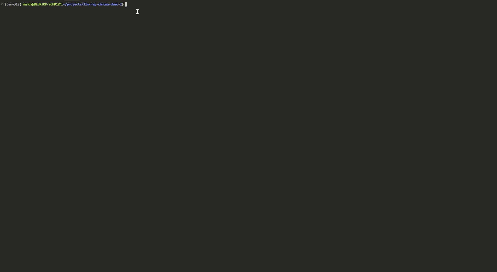

# RAG System

<p align="center">
  <!-- Runtime & License -->
  <a href="https://www.python.org/downloads/">
    
  </a>
  <a href="https://www.gnu.org/licenses/gpl-3.0">
    
  </a>
</p>

<p align="center">
  <!-- CI/CD & Coverage -->
  <a href="https://github.com/mehdimahmoud/llm-rag-chroma-demo/actions/workflows/ci.yml">
    
  </a>
  <a href="https://codecov.io/gh/mehdimahmoud/llm-rag-chroma-demo">
    
  </a>
</p>

<p align="center">
  <!-- Code Quality & Security -->
  <a href="https://flake8.pycqa.org/">
    
  </a>
  <a href="http://mypy-lang.org/">
    
  </a>
  <a href="https://bandit.readthedocs.io/">
    
  </a>
  <a href="https://github.com/psf/black">
    
  </a>
  <a href="https://pycqa.github.io/isort/">
    
  </a>
  <a href="https://github.com/PyCQA/autoflake">
    
  </a>
</p>

<p align="center">
  <!-- Tech Stack -->
  <a href="https://github.com/langchain-ai/langchain">
    
  </a>
  <a href="https://github.com/chroma-core/chroma">
    
  </a>
  <a href="https://huggingface.co/">
    
  </a>
  <a href="https://www.sbert.net/">
    
  </a>
</p>

A robust, production-quality **Retrieval-Augmented Generation (RAG)** system template built with LangChain and ChromaDB.

Suitable for local use, internal enterprise deployments, or as a foundation for building scalable, production-ready RAG applications. While not yet a fully production-hardened or scalable solution, it demonstrates enterprise-level best practices in code quality, testing, and extensibility.

<p align="center">
  
</p>
<p align="center"><b>Demo: Web UI in Action</b></p>

## 📚 Table of Contents

- [Features](#-features)
- [Requirements](#-requirements)
- [Installation](#️-installation)
- [Configuration](#️-configuration)
- [Usage](#-usage)
- [Project Structure](#️-project-structure)
- [Testing](#-testing)
- [Development](#-development)
- [Monitoring](#-monitoring)
- [Deployment](#-deployment)
- [Contributing](#-contributing)
- [License](#-license)
- [Acknowledgments](#-acknowledgments)
- [Support](#-support)
- [Consultation](#-consultation)

## 🚀 Features

- **Multi-format Document Support**: PDF, TXT, DOCX, MD, CSV, XLSX
- **Advanced Text Processing**: Intelligent chunking with configurable overlap
- **Vector Storage**: ChromaDB integration with persistent storage
- **Embedding Generation**: Sentence Transformers models via Hugging Face with customizable model selection
- **Dual Interface**: Command-line and Streamlit web UI
- **Structured Logging**: Logging with correlation IDs
- **Type Safety**: Comprehensive type hints with MyPy integration
- **Testing**: Comprehensive test suite with enterprise-grade fixtures
- **Code Quality**: Black, isort, flake8, autoflake, and bandit security scanning

## 📋 Requirements

- **Python 3.12+** (required - the project uses Python 3.12 features)
- CUDA-compatible GPU (optional, for faster embedding generation)

## 🛠️ Installation

### Complete Setup

```bash
# 1. Clone the repository
git clone <repository-url>
cd llm-rag-chroma-demo

# 2. Create virtual environment with Python 3.12
python3.12 -m venv venv312  # For Python 3.12 (required)
# OR
python -m venv venv  # Uses your default Python (must be 3.12+)

# 3. Activate virtual environment that you have created above
source venv312/bin/activate  # On Linux/Mac (if using venv312)
# OR
source venv/bin/activate     # On Linux/Mac (if using venv)
# OR
venv312\Scripts\activate     # On Windows (if using venv312)
# OR
venv\Scripts\activate        # On Windows (if using venv)

# 4. Install dependencies
make install-dev

# 5. Verify installation
make info
```

### Quick Setup (if you already have a virtual environment)

```bash
# Navigate to your existing project directory
cd llm-rag-chroma-demo

# Activate your existing virtual environment (must be Python 3.12+)
source venv/bin/activate  # On Linux/Mac
# OR
venv\Scripts\activate     # On Windows

# Install dependencies
make install-dev
```

## ⚙️ Configuration

The project is designed to work out-of-the-box with sensible defaults. Configuration is managed via environment variables, which you can set up using a `.env` file.

### 1. Start with the Default Configuration

A template file, `.env.default`, is provided in the project root. To get started, copy this file to `.env`:

```bash
cp .env.default .env
```

You can then edit `.env` to customize your settings as needed.

### 2. OpenAI API Key (Optional)

- The project will run **with or without** an OpenAI API key.

**With an OpenAI API Key:**  
If you provide an OpenAI API key, the system can combine your enterprise's private or customer documents with powerful LLMs (like OpenAI) to deliver richer, more accurate, and context-aware responses. This enables advanced inference by leveraging both your internal knowledge base and state-of-the-art language models.

**Without an OpenAI API Key:**  
If you do **not** provide an OpenAI API key, the RAG system will still function as a robust query engine over your embedded document store. In this mode, responses are generated purely from your indexed documents, without LLM-powered augmentation. This is suitable for environments where external API calls are restricted or not desired, but may result in less nuanced or generative answers.

To use an OpenAI API key, add it to your `.env` file:
```
OPENAI_API_KEY=your-openai-api-key
```

### 3. Other Configuration Options

You can further customize the system by editing other variables in your `.env` file, such as:
- Logging level
- Supported file types
- Chunk size and overlap
- ChromaDB settings
- Embedding model

All available options are documented in `.env.default` with comments.

**Summary:**
- Copy `.env.default` to `.env` and edit as needed.
- OpenAI API key is optional, but recommended for best inference quality.
- The project works out-of-the-box with default settings.

## 🎯 Usage

### Quick Start

```bash
# Run the demo
make run-demo

# Or start the web interface
make run-ui
```

### Demo: Running `make run-demo`

Below is a demonstration of how to run the demo and what output to expect:

<p align="center">
  
</p>

### Command Line Interface

```bash
# Interactive mode
rag-demo interactive

# Ingest all documents
rag-demo ingest

# Query the system
rag-demo query "What are the HR policies?"

# Get system statistics
rag-demo stats

# Clear the database
rag-demo clear
```

### Web Interface

```bash
# Start Streamlit UI
make run-ui
# or
streamlit run rag_web_interface.py
```

### Programmatic Usage

```python
from rag_system import RAGSystem

# Initialize the system
rag = RAGSystem()

# Ingest documents
stats = rag.ingest_documents()
print(f"Processed {stats['documents_stored']} documents")

# Query the system
results = rag.query("What are the vacation policies?")
for doc in results:
    print(f"Source: {doc.metadata['source']}")
    print(f"Content: {doc.page_content[:200]}...")
```

## 🏗️ Project Structure

```
rag-system/
├── rag_system/                 # Main package
│   ├── core/                   # Core functionality
│   │   ├── config.py          # Configuration management
│   │   └── logging.py         # Structured logging
│   ├── ingestion/             # Document processing
│   │   ├── document_loader.py # Multi-format document loading
│   │   ├── text_processor.py  # Text chunking and embedding
│   │   └── vector_store.py    # ChromaDB integration
│   ├── ui/                    # User interfaces
│   │   └── streamlit_app.py   # Streamlit web UI
│   ├── cli.py                 # Command-line interface
│   └── rag_system.py          # Main orchestrator
├── tests/                     # Test suite
│   ├── test_core_config.py    # Configuration tests
│   └── test_ingestion.py      # Ingestion component tests
├── data/                      # Document storage
├── rag_demo.py               # Demo script
├── rag_web_interface.py      # Web interface
├── pyproject.toml             # Project configuration
├── Makefile                   # Development workflow
└── README.md                  # This file
```

## 🧪 Testing

```bash
# Run all tests
make test

# Run tests with coverage
make test-cov

# Run tests in watch mode
make test-watch

# Quick test cycle (format + lint + test)
make quick-test

# Run specific test file
pytest tests/test_ingestion.py -v

# Run tests with specific marker
pytest -m "slow" -v
```

## 🔧 Development

### Code Quality and Type Safety

This project maintains enterprise-grade code quality with:

- **Comprehensive Type Annotations**: All functions, methods, and variables have type hints
- **Static Type Checking**: MyPy integration ensures type safety across the codebase
- **Code Formatting**: Black and isort ensure consistent code style
- **Linting**: Flake8 and autoflake maintain code quality
- **Security Scanning**: Bandit identifies potential security issues
- **Testing**: Comprehensive test suite with clean fixtures

### Code Quality

```bash
# Format code (black + isort)
make format

# Run linting (flake8 + autoflake)
make lint

# Type checking (mypy)
make type-check

# Security scanning (bandit)
make security-check

# All quality checks
make check-all

# Clean unused imports and variables
make clean-imports

# Pre-commit validation (runs automatically on staged files)
# The custom pre-commit hook runs the same tools as make check-all
# but only on staged files during git commit
```

### Development Workflow

```bash
# Complete development setup
make dev-setup

# Clean build artifacts
make clean

# (Recommended) Unset all environment variables from .env in your current shell
source clean-env.sh

# Build package
make build

# System information
make info
```

## 📊 Monitoring

The system includes comprehensive logging:

```python
import structlog

# Structured logging with correlation IDs
logger = structlog.get_logger(__name__)
logger.info("Processing document",
           document_id="doc_123",
           file_type="pdf",
           chunk_count=15)
```

## 🚀 Deployment

### Production Setup

1. **Environment Configuration**:
   ```bash
   export PRODUCTION=true
   export LOG_LEVEL=WARNING
   export CHROMA_PERSIST_DIRECTORY=chroma_db
   ```

2. **Install Production Dependencies**:
   ```bash
   make install
   ```

3. **Initialize System**:
   ```bash
   rag-demo ingest
   ```

### Docker (Future)

```bash
# Build image
make docker-build

# Run container
make docker-run
```

## 🤝 Contributing

We welcome contributions! Please see our [CONTRIBUTING.md](CONTRIBUTING.md) for guidelines and best practices.

1. Fork the repository
2. Create a feature branch: `git checkout -b feature/amazing-feature`
3. Make your changes and add tests
4. Run quality checks: `make check-all`
5. Commit your changes: `git commit -m 'Add amazing feature'`
6. Push to the branch: `git push origin feature/amazing-feature`
7. Open a Pull Request

### Development Guidelines

- Use snake_case for files and functions
- Use PascalCase for classes
- Write comprehensive docstrings
- Maintain 80%+ test coverage
- **Follow comprehensive type hints throughout**
- **Raise exceptions rather than returning error strings**
- **Never commit `.env` files** - use `.env.default` as template
- **Run `make check-all` before committing**
- **Pre-commit hooks run automatically** on staged files during commit

## 📝 License

This project is licensed under the GNU General Public License v3 - see the [LICENSE](LICENSE) file for details.

## 🙏 Acknowledgments

- [LangChain](https://github.com/langchain-ai/langchain) for the RAG framework
- [ChromaDB](https://github.com/chroma-core/chroma) for vector storage
- [Sentence Transformers](https://github.com/UKPLab/sentence-transformers) for embeddings via [Hugging Face](https://huggingface.co/)
- [Streamlit](https://streamlit.io/) for the web interface

## 📞 Support

For support and questions:

- Create an [issue](https://github.com/mehdimahmoud/llm-rag-chroma-demo/issues)
- Check the [documentation](docs/)
- Review the [examples](docs/EXAMPLES.md)

## 💼 Consultation

Need help implementing this RAG system in your organization? I offer:

- **Custom RAG Solutions**: Tailored implementations for your specific use case
- **Architecture Review**: Optimize your AI/ML infrastructure design
- **Production Deployment**: From prototype to production-ready systems
- **Team Training**: Workshops on RAG systems and best practices
- **Ongoing Support**: Maintenance, optimization, and feature development

**Ready to accelerate your AI initiatives?** [Book a consultation](https://topmate.io/mehdi_khoder) to discuss your project requirements.

---

**Built with ❤️ for production AI applications**
