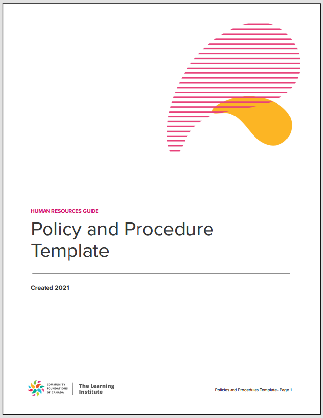

# RAG System Test Questions – HR Guide: Policy and Procedure Template

  

<b>Figure: Cover of the HR Guide Policy and Procedure Template (2021)</b>

This page provides a structured assessment framework and stress-test questions for evaluating your RAG system using the HR-Guide_-Policy-and-Procedure-Template.pdf. Questions are organized by document section, cognitive complexity, and include expected answers and evaluation criteria.

---

## Table of Contents
- [1. Factual Retrieval (Direct Answers from Text)](#1-factual-retrieval-direct-answers-from-text)
- [2. Interpretive Understanding (Requires Synthesis)](#2-interpretive-understanding-requires-synthesis)
- [3. Applied Scenarios (Real-World Policy Application)](#3-applied-scenarios-real-world-policy-application)
- [4. Cross-Referencing & Compliance](#4-cross-referencing--compliance)
- [5. Edge Cases & Exceptions](#5-edge-cases--exceptions)
- [Suggested Evaluation Metrics](#suggested-evaluation-metrics)
- [Stress-Test Questions](#stress-test-questions)
  - [1. Contradictory Policy Detection](#1-contradictory-policy-detection)
  - [2. Ambiguous Phrasing Interpretation](#2-ambiguous-phrasing-interpretation)
  - [3. Jurisdictional Complexity](#3-jurisdictional-complexity)
  - [4. Hypothetical Edge Cases](#4-hypothetical-edge-cases)
  - [5. Stress-Test Metrics](#5-stress-test-metrics)

---

## 1. Factual Retrieval (Direct Answers from Text)
*Tests basic retrieval accuracy.*

| Question | Expected Answer | Section |
|----------|----------------|---------|
| What are the three basic rights for employees under the health and safety model? | 1. Right to know about hazards, 2. Right to refuse unsafe work, 3. Right to participate in safety processes. | Section 5 (Health and Safety) |
| How many days of sick leave does a full-time employee accrue annually? | 10 days per calendar year. | Section 4 (Sick Leave) |
| What is the maximum probationary period for new employees? | 6 months (extendable by another 6 months if needed). | Section 6 (Probationary Review) |
| Which provincial legislation governs workplace harassment in Alberta? | Alberta Human Rights Act. | Appendix A (Alberta) |
| Who is the official spokesperson for the Foundation's governance issues? | Chair of the Board. | Section 3 (Contact with Media) |

**Evaluation Criteria:**
- Accuracy: Exact phrasing from the document.
- Speed: Time to retrieve the answer.

---

## 2. Interpretive Understanding (Requires Synthesis)
*Tests comprehension of policies and procedures.*

| Question | Expected Answer | Section |
|----------|----------------|---------|
| Under what conditions can an employee use Foundation equipment for personal purposes? | 1. Prior approval from ED/CEO, 2. Portable/non-consumable equipment, 3. Negligible cost to Foundation. | Section 3 (Personal Use of Equipment) |
| How does the Foundation handle a conflict of interest for a contractor? | Contractor must disclose the conflict, abstain from discussions, and ensure minutes reflect this. | Section 2 (Conflict of Interest) |
| What steps must an employee take to report harassment? | 1. Confront the harasser (if safe), 2. Document details, 3. Report to supervisor/ED/CEO/Board Chair within 7 days. | Section 7 (Anti-Harassment Policy) |
| Why is progressive discipline emphasized over punitive action? | To correct behavior, not punish, and provide clear improvement goals. | Section 7 (Progressive Discipline) |

**Evaluation Criteria:**
- Logical consistency: Answers must align with policy intent.
- Contextual relevance: No irrelevant details.

---

## 3. Applied Scenarios (Real-World Policy Application)
*Tests ability to infer correct policy application.*

| Scenario | Correct Policy Application | Section |
|----------|---------------------------|---------|
| An employee wants to work a second job. What restrictions apply? | No use of Foundation time/equipment, no conflict of interest, no solicitation of donors. | Section 3 (Outside Employment) |
| An employee is injured at work. What are their rights? | Right to Workers' Compensation, no retaliation for reporting, access to medical leave. | Section 5 (Health and Safety) + Appendix A |
| A donor requests anonymity. How should staff handle this? | Strict confidentiality; limit access to donor info; no sharing with other orgs. | Section 2 (Confidentiality) |
| An employee refuses to work overtime. Is this allowed? | Only if work is unsafe (per "right to refuse" in Health and Safety). Otherwise, overtime must be pre-approved. | Section 3 (Overtime) + Section 5 |

**Evaluation Criteria:**
- Policy alignment: Correctly applies rules to scenarios.
- Avoids hallucination: No invented exceptions.

---

## 4. Cross-Referencing & Compliance
*Tests awareness of legal dependencies.*

| Question | Expected Answer | Section |
|----------|----------------|---------|
| Where should a Foundation in Ontario check for updates to vacation pay rules? | Ontario Employment Standards Act (linked in Appendix A). | Appendix A (Ontario) |
| How does the policy align with PIPEDA for employee data? | Personnel files require written consent for disclosure. | Section 3 (Personnel Confidentiality) |
| What federal/provincial laws override Foundation policies? | Provincial employment standards, human rights codes, and occupational safety acts. | Section 1 (Introduction) |

**Evaluation Criteria:**
- Precision: Correctly identifies overlapping regulations.
- Completeness: No omitted critical laws.

---

## 5. Edge Cases & Exceptions
*Tests handling of nuanced or rare cases.*

| Question | Expected Answer | Section |
|----------|----------------|---------|
| Can an employee be fired for a first-time minor policy violation? | No; progressive discipline requires verbal/written warnings first (unless gross misconduct). | Section 7 (Progressive Discipline) |
| Is a volunteer covered by the Foundation's non-owned auto insurance? | Yes, if using their vehicle for Foundation business (same as employees). | Section 3 (Insurance for Personal Auto Use) |
| What happens if an employee doesn't take accrued vacation? | Paid out at anniversary date (unless provincial law requires earlier payout). | Section 4 (Vacation) |

**Evaluation Criteria:**
- Nuance: Recognizes exceptions without overgeneralizing.
- Legal awareness: Cites provincial variability where applicable.

---

## Suggested Evaluation Metrics
1. Accuracy: % of answers matching expected responses.
2. Completeness: Coverage of all policy aspects (e.g., not missing "right to know" in safety rights).
3. Speed: Time per question (ideal: <5 sec for factual, <10 sec for interpretive).
4. Hallucination Rate: % of answers introducing unsupported claims.

---

# Stress-Test Questions

## 1. Contradictory Policy Detection
*Tests if the system can identify and resolve conflicts within the document.*

| Question | Expected Answer | Evaluation Focus |
|----------|----------------|-----------------|
| The policy states employees must take 2 weeks of vacation yearly, but another section says unused vacation is paid out. Is this a contradiction? | No. Employees must schedule 2 weeks off, but unused days are paid if not taken by the anniversary date. Clarify: Mandatory time off ≠ forfeiture. | Logical consistency |
| Can an employee be fired immediately for violating the Code of Ethics, or must progressive discipline be followed? | Depends. Gross ethics violations (e.g., theft) may justify immediate termination, but minor issues require progressive steps. Cite Section 7 (Progressive Discipline) vs. Section 2 (Code of Ethics). | Policy hierarchy |

## 2. Ambiguous Phrasing Interpretation
*Tests handling of vague or incomplete policy language.*

| Question | Expected Answer | Evaluation Focus |
|----------|----------------|-----------------|
| The dress code says "appropriate business attire" for client meetings. Does this prohibit jeans? | Context-dependent. Policy allows "casual dress" normally but defers to supervisor discretion for client meetings. Recommend clarifying with ED/CEO. | Contextual inference |
| The overtime policy mentions "emergency situations." Does this include last-minute donor requests? | Unclear. Policy requires "prior consent" but allows emergencies. Foundation should define "emergency" (e.g., operational vs. donor needs). Flag for HR review. | Gap identification |

## 3. Jurisdictional Complexity
*Tests awareness of provincial/federal legal overlaps.*

| Question | Expected Answer | Evaluation Focus |
|----------|----------------|-----------------|
| A Quebec employee requests 18 months of parental leave. Does the Foundation's 12-month limit apply? | No. Quebec's Act Respecting Labour Standards overrides Foundation policy (Appendix A). Must grant 18 months. | Legal precedence |
| An Alberta employee refuses to work on a statutory holiday. Can they be disciplined? | No. Alberta's Employment Standards Code protects holiday refusal unless employed in essential services. | Compliance checks |

## 4. Hypothetical Edge Cases
*Tests extrapolation beyond explicit policy text.*

| Scenario | Correct Policy Application | Evaluation Focus |
|----------|---------------------------|-----------------|
| An employee uses Foundation Wi-Fi to stream movies during lunch. Violation? | Yes. Personal use must be "minimal" (Section 3: Technology Use). Streaming likely exceeds "negligible cost." | Policy extrapolation |
| A volunteer is harassed by a donor at an offsite event. Covered under the anti-harassment policy? | Yes. Policy applies to all individuals associated with the Foundation, including volunteers (Section 7). | Scope awareness |

## 5. Stress-Test Metrics
1. Conflict Resolution Score: % of contradictory policies correctly reconciled.
2. Ambiguity Handling:
   - Precision: Avoids overconfident answers (e.g., "The policy is unclear" vs. inventing rules).
   - Suggestions: Proposes actionable next steps (e.g., "Consult ED/CEO").
3. Jurisdictional Accuracy: Correctly identifies when provincial law overrides policy.
4. Edge-Case Robustness: Avoids hallucination in unstated scenarios.

**Example Failure Modes to Monitor:**
- False Certainty: Asserting a dress code prohibition without policy backing.
- Overgeneralization: Assuming all provinces have the same overtime rules.
- Omission: Ignoring that volunteers are covered in harassment cases. 