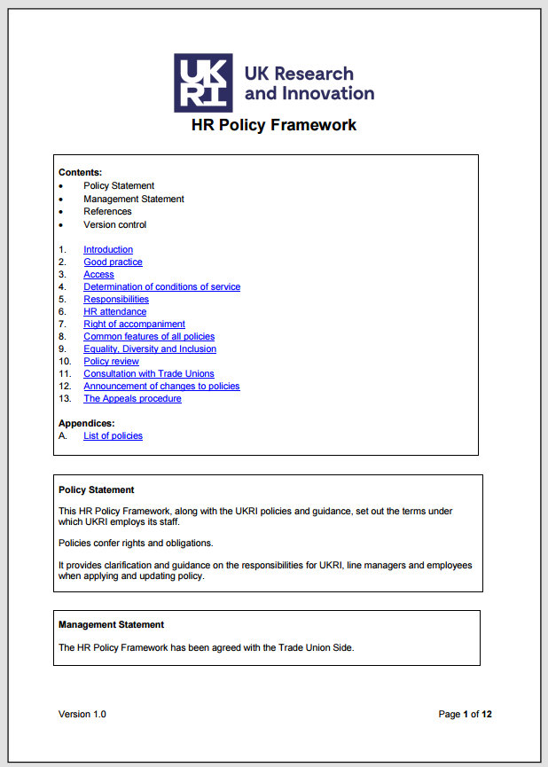

# UKRI HR Policy Framework – Questions with Expected Answers and Sections

  

<b>Figure: Cover of the UKRI HR Policy Framework</b>

Welcome to the UKRI HR Policy Framework RAG System Test Questions page! This resource is designed to rigorously evaluate your Retrieval-Augmented Generation (RAG) system using a comprehensive set of questions based on the UKRI HR Policy Framework. The questions are organized by complexity, from direct retrieval to advanced synthesis and inference, and are ideal for benchmarking, debugging, and demonstrating your system's capabilities on real-world HR policy content.

---

## Table of Contents
- [Policy Framework Structure Questions](#policy-framework-structure-questions)
- [Employee Rights and Procedures Questions](#employee-rights-and-procedures-questions)
- [Data Protection and Privacy Questions](#data-protection-and-privacy-questions)
- [Equality, Diversity and Inclusion Questions](#equality-diversity-and-inclusion-questions)
- [Appeals Process Questions](#appeals-process-questions)
- [Policy Management Questions](#policy-management-questions)
- [Full Question Set by Complexity](#full-question-set-by-complexity)
- [Testing Categories Summary](#testing-categories-summary)
- [Evaluation Criteria](#evaluation-criteria)

---

## Policy Framework Structure Questions

| Question | Expected Answer | Section |
|----------|----------------|---------|
| What is the purpose of the UKRI HR Policy Framework? | This HR Policy Framework, along with the UKRI policies and guidance, set out the terms under which UKRI employs its staff. It provides clarification and guidance on responsibilities for UKRI, line managers and employees. | Policy Statement |
| Which department sponsors UKRI? | Business Energy and Industrial Strategy, as the sponsor department | Section 5.2.2 |
| What are the three essential parties to policy according to UKRI? | UKRI as the employer, the line manager, and the employee | Section 5.1 |

## Employee Rights and Procedures Questions

| Question | Expected Answer | Section |
|----------|----------------|---------|
| What is the time limit for submitting an appeal? | Appeals should be submitted in writing within seven working days of receipt of the decision letter | Section 13.1.4 |
| Who has the right to be accompanied at formal procedures? | At all stages of formal procedure, the employee has the right to be accompanied by a work colleague or a Trade Union representative | Section 7.1 |
| How long can an employee postpone a meeting if their chosen companion is unavailable? | The employee has the right to request a postponement of up to five working days | Section 7.1 |

## Data Protection and Privacy Questions

| Question | Expected Answer | Section |
|----------|----------------|---------|
| Where can employee records and data be stored according to UKRI policy? | Employee records and data can only be stored in Oracle or WorkDay or any other approved platform with restricted access. No employee data may be retained on email. | Section 8.1.3.9.6.1 |
| What is UKRI's policy on covert recording of meetings? | Covert recording of meetings, formal reviews, assessments, appeals or hearings is explicitly prohibited. It may trigger disciplinary action. | Section 8.1.4.5 |
| Can witness statements be anonymised? | Yes, UKRI reserves the right to conceal the identity of witnesses if deemed necessary and appropriate, though this will only be done in exceptional circumstances. | Section 8.1.3.4 |

## Equality, Diversity and Inclusion Questions

| Question | Expected Answer | Section |
|----------|----------------|---------|
| What is UKRI's EDI statement? | Everyone has a right to be treated with dignity and respect, and to be provided with opportunities to flourish and succeed in a supportive environment. Diversity of ideas, experience and cultures produces and sustains the best results and performance. | Section 9.1.1 |
| What criteria are used for Equality Impact assessments? | Whether there is an impact on groups of employees with protected characteristics as defined in the Equality Act 2010, and whether the policy has the potential to discriminate or disadvantage employees. | Section 9.2 |

## Appeals Process Questions

| Question | Expected Answer | Section |
|----------|----------------|---------|
| What are the three possible outcomes of an appeal hearing? | Uphold the current decision (reject appeal), amend the current decision (substitute alternative), or overturn the current decision (uphold appeal). | Section 13.5.2 |
| How long should an appeal hearing be held after receipt of the appeal? | The appeal hearing should be held where possible within 10 working days of receipt of the letter containing the grounds of appeal. | Section 13.3.4.3 |
| Is there a right to further appeal after an appeal hearing decision? | No, the decision made at an appeal hearing is final, with no further right of internal appeal. | Section 13.5.3 |

## Policy Management Questions

| Question | Expected Answer | Section |
|----------|----------------|---------|
| How many policies are listed in Appendix A? | 18 policies are listed (A1.1 through A1.18) | Appendix A |
| When will policies be reviewed? | Policies will be reviewed when there are changes in employment law that are relevant, where there is a change in business need, or when feedback suggests the policy is out of date or unfit for purpose. | Section 10.1 |
| Who must be consulted before formal action is initiated? | Before formal action is initiated under a relevant policy, the line manager should consult HR. | Section 6.1 |

---

## Full Question Set by Complexity

# Level 1: Simple Factual Questions (Direct Information Retrieval)

## 1.1 Basic Policy Information
| Question | Expected Answer | Section |
|----------|----------------|---------|
| What is the version number of the HR Policy Framework? | Version 1.0 | Version control table |
| When was the HR Policy Framework created? | January 2020 | Version control table |
| Who agreed to the HR Policy Framework? | The Trade Union Side | Management Statement |
| What is the sponsor department for UKRI? | Business Energy and Industrial Strategy | Section 5.2.2 |

## 1.2 Simple List Questions
| Question | Expected Answer | Section |
|----------|----------------|---------|
| How many policies are listed in Appendix A? | 18 policies | Appendix A |
| Name three types of people covered by this policy framework. | UKRI employees, workers, contractors (and visitors) | Section 1.2 |
| What are the three essential parties to policy mentioned in section 5.1? | UKRI as the employer, the line manager, the employee | Section 5.1.1-5.1.3 |

## 1.3 Direct Definition Questions
| Question | Expected Answer | Section |
|----------|----------------|---------|
| What does UKRI stand for? | UK Research and Innovation | Section 8.1.3.1 |
| What is the purpose of an appeal according to section 13.2? | To determine whether the action/decision/sanction was fair and reasonable and whether the procedure was followed correctly | Section 13.2.1 |
| What is the maximum time limit for submitting an appeal? | Seven working days of the receipt of the decision letter | Section 13.1.4 |

# Level 2: Moderate Complexity Questions (Synthesis and Understanding)

## 2.1 Process and Procedure Questions
| Question | Expected Answer | Section |
|----------|----------------|---------|
| What steps must be taken before initiating formal action under a policy? | The line manager should consult HR before formal action is initiated | Section 6.1 |
| Describe the process for arranging an appeal hearing. | Chair should acknowledge receipt, advise of accompaniment rights, hold hearing within 10 working days, ensure HR support | Section 13.3.4 |
| What happens if an employee persistently fails to attend an appeal hearing? | If persistently unable/unwilling over one month without valid justification, the appeal hearing will take place in the employee's absence | Section 13.3.8, 13.4.6 |
| Who can accompany an employee during formal procedures? | A work colleague or a Trade Union representative | Section 7.1 |

## 2.2 Responsibility and Role Questions
| Question | Expected Answer | Section |
|----------|----------------|---------|
| What are the key responsibilities of line managers according to this framework? | Familiarize with policy, direct employees to policies, ensure consistency, engage with HR when required, ensure employee adherence | Section 5.4 |
| What must employees do to comply with UKRI policies? | Familiarize with policy, use and follow policy, inform of personal changes, inform of non-conformance risks | Section 5.5 |
| What role does HR play in formal meetings? | HR supports the line manager and ensures correct policy and process is followed | Section 6.2 |
| Who has the authority to make dismissal decisions? | The person with delegated authority to dismiss in consultation with HR | Section 8.1.5.1-8.1.5.2 |

## 2.3 Rights and Entitlements Questions
| Question | Expected Answer | Section |
|----------|----------------|---------|
| What rights do employees have regarding accompaniment during formal procedures? | Right to be accompanied by work colleague or Trade Union representative, plus right to postpone up to 5 working days if companion unavailable | Section 7.1 |
| Under what circumstances can meeting recordings be made? | Only if exceptionally agreed by all attendees beforehand | Section 8.1.4.4 |
| What data protection rights do employees have regarding their personal information? | Rights to see, correct or erase personal data held, considered on case-by-case basis | Section 8.1.3.6 |
| What is the right to postponement for appeal hearings? | Employee may suggest alternative date within 5 working days if chosen representative not available | Section 13.3.6 |

# Level 3: Complex Analytical Questions (Cross-referencing and Inference)

## 3.1 Policy Integration Questions
| Question | Expected Answer | Section |
|----------|----------------|---------|
| How does the Equality Act 2010 influence UKRI's approach to policy implementation? | UKRI must make reasonable adjustments to ensure services are accessible to disabled people, including policy and procedure changes | Section 1.3 |
| Explain the relationship between data protection principles and HR policy implementation. | Seven data protection principles govern HR policy: lawful/fair/transparent, purpose limitation, data minimization, storage limitation, accuracy, integrity/confidentiality, accountability | Section 8.1.3.9 |
| How do the common features described in section 8 apply across all UKRI policies? | Common features are recorded in framework document and linked to all policies, include duty to consider requests, records management, data protection, meeting notes, dismissals | Section 8.1 |
| What is the connection between reasonable adjustments and policy accessibility? | Reasonable adjustments ensure policy accessibility for disabled people, including changes to policies and procedures | Section 1.3, 3.1 |

## 3.2 Situational Analysis Questions
| Question | Expected Answer | Section |
|----------|----------------|---------|
| If an employee wants to appeal a decision but their chosen representative is unavailable, what options do they have and what are the time constraints? | Can request postponement up to 5 working days if companion unavailable, or suggest alternative date within 5 working days of original | Section 7.1, 13.3.6 |
| What would happen if an employee covertly records a formal meeting, and how does this relate to data protection and misconduct policies? | Covert recording is explicitly prohibited, may trigger disciplinary action (though not normally gross misconduct) | Section 8.1.4.5 |
| How does UKRI balance transparency with confidentiality in formal procedures involving witness statements? | UKRI may anonymize witness statements if necessary and appropriate, but only in exceptional circumstances as it may weaken cases | Section 8.1.3.4, 8.1.3.7 |
| What considerations must be made when determining whether to anonymize witness statements? | Only in exceptional circumstances, recognition that anonymization may weaken case if further action taken against alleged perpetrator | Section 8.1.3.7 |

## 3.3 Policy Interpretation Questions
| Question | Expected Answer | Section |
|----------|----------------|---------|
| How does UKRI ensure consistency in policy application while allowing for different outcomes based on circumstances? | Consistency of application is essential, but outcomes may vary according to circumstances while maintaining consistent policy application | Section 1.4, 5.4.3 |
| What mechanisms are in place to ensure policies remain current and effective? | Policies reviewed when employment law changes, business needs change, or feedback suggests policy is outdated or unfit for purpose | Section 10.1 |
| How does the consultation process with Trade Unions influence policy development and changes? | UKRI consults with Trade Unions with view to reaching agreement through Joint Consultation framework based on collective bargaining | Section 11.1, 4.2 |

# Level 4: Advanced Synthesis Questions (Multi-section Integration)

## 4.1 Framework Integration Questions
| Question | Expected Answer | Section |
|----------|----------------|---------|
| How do the responsibilities outlined in section 5 align with the common features described in section 8? | Section 5 responsibilities (UKRI, line manager, employee) are supported by section 8 common features (duty to consider, data protection, meeting procedures) | Section 5, 8 |
| Explain how the appeals procedure supports the overall policy framework's objectives. | Appeals provide fairness mechanism to review decisions, ensure procedures followed correctly, allow new evidence, and remedy defective processes | Section 13 |
| How do the data protection principles in section 8.1.3 interact with the record-keeping requirements for formal procedures? | Data protection principles govern how records are kept, ensuring lawful processing, data minimization, accuracy, and appropriate retention periods | Section 8.1.3, 8.1.4 |
| What role does the Equality, Diversity and Inclusion statement play in the broader policy framework? | Provides governing principle that everyone has right to dignity, respect, and opportunities in supportive environment; all policies subject to equality impact assessment | Section 9.1, 9.2 |

## 4.2 Operational Implementation Questions
| Question | Expected Answer | Section |
|----------|----------------|---------|
| If a line manager needs to dismiss an employee, what combination of consultations, authorities, and procedures must be followed according to this framework? | Must consult HR before formal action, decision taken by person with delegated authority in consultation with HR, full review of all factors including employment history | Section 6.1, 8.1.5 |
| How does UKRI ensure that disabled employees can fully participate in all policy-related processes? | Through reasonable adjustments under Equality Act 2010, policy accessibility measures, equality impact assessments, and usability testing | Section 1.3, 3.1, 9.2, 9.3 |
| What safeguards exist to protect both employees and the organization during formal procedures? | HR attendance at meetings, right of accompaniment, proper note-taking, data protection compliance, appeals process, prohibition of covert recording | Multiple sections |

## 4.3 Strategic Policy Questions
| Question | Expected Answer | Section |
|----------|----------------|---------|
| How does this framework support UKRI's mission while balancing employee rights and organizational needs? | Framework written to comply with employment law while allowing line manager discretion in balancing UKRI and employee needs | Section 1.4 |
| What mechanisms ensure that policy changes are effectively communicated and implemented across the organization? | Changes communicated after Trade Union consultation, policies accessible via UKRI Hub and intranets, alternative access available, included in induction | Section 12.1, 12.2, 1.5.2 |
| How does the framework address potential conflicts between individual employee needs and organizational requirements? | Through reasonable adjustments, duty to consider reasonable requests, line manager discretion, and formal procedures with appeals | Section 1.3, 8.1.1.1, 1.4 |

# Level 5: Edge Cases and Ambiguous Scenarios

## 5.1 Exception Handling Questions
| Question | Expected Answer | Section |
|----------|----------------|---------|
| What happens if an employee's chosen representative is also involved in the case being appealed? | Not explicitly addressed, but appeal would likely need to be heard by someone with no previous involvement to avoid conflict of interest | Section 13.3.1 (implied) |
| How are appeals handled when they involve senior managers or when conflicts of interest arise? | In exceptional cases, appeal may be heard by someone outside of UKRI to avoid conflict of interest | Section 13.3.1 |
| What procedures apply when an employee disagrees with the notes taken during a formal meeting? | Disagreements will be noted and copies of notes given to employee, but this will not delay decision being made | Section 8.1.4.3 |
| How does UKRI handle situations where statutory requirements conflict with established policies? | Framework written to comply with employment law, suggesting statutory requirements take precedence | Section 1.4 |

## 5.2 Boundary Testing Questions
| Question | Expected Answer | Section |
|----------|----------------|---------|
| What constitutes "exceptional circumstances" for allowing written submissions instead of hearing attendance? | Employee unable to attend for legitimate reasons, may be allowed written submissions in very unusual circumstances | Section 13.3.7, 13.4.7 |
| How does UKRI define "reasonable requests" that line managers have a duty to consider? | Requests related to policy that should be viewed favourably and agreed where reasonable | Section 8.1.1.1 |
| What are the limits of line manager discretion within the policy framework? | Discretion allowed in balancing UKRI and employee needs, but must maintain consistency of application and comply with employment law | Section 1.4, 5.4.3 |

# Level 6: Implicit Knowledge and Context Questions

## 6.1 Inferential Questions
| Question | Expected Answer | Section |
|----------|----------------|---------|
| Why might UKRI prohibit covert recording of meetings, and what does this suggest about their approach to trust and transparency? | Prohibition suggests emphasis on open, transparent communication and trust-based relationships rather than covert surveillance | Section 8.1.4.5 |
| What can be inferred about UKRI's organizational culture from the emphasis on consultation and agreement with Trade Unions? | Suggests collaborative, consultative culture that values collective bargaining and seeks agreement rather than imposing unilateral decisions | Multiple sections |
| How does the framework's approach to data minimization reflect broader organizational values? | Reflects commitment to privacy, efficiency, and ethical data handling by only collecting necessary data | Section 8.1.3.9.3 |

## 6.2 Policy Philosophy Questions
| Question | Expected Answer | Section |
|----------|----------------|---------|
| What principles underlie UKRI's approach to balancing individual rights with organizational needs? | Compliance with employment law, line manager discretion, consistency of application with varied outcomes, reasonable adjustments | Section 1.4 |
| How does the framework demonstrate UKRI's commitment to fair and transparent employment practices? | Through comprehensive appeals process, data protection compliance, equality impact assessments, Trade Union consultation, right of accompaniment | Multiple sections |
| What does the policy review process reveal about UKRI's approach to continuous improvement? | Regular review based on legal changes, business needs, and feedback demonstrates commitment to keeping policies current and effective | Section 10.1 |

---

## Testing Categories Summary

- **Direct Retrieval (Q1-10)**: Tests basic information extraction
- **Comprehension (Q11-22)**: Tests understanding of processes and procedures
- **Analysis (Q23-33)**: Tests ability to connect different policy sections
- **Synthesis (Q34-43)**: Tests integration of multiple concepts
- **Edge Cases (Q44-50)**: Tests handling of complex scenarios
- **Inference (Q51-56)**: Tests ability to understand implicit meanings and context

## Evaluation Criteria

For each question, assess your RAG system on:
- **Accuracy**: Correctness of the retrieved information
- **Completeness**: Whether all relevant information is included
- **Relevance**: Appropriateness of the retrieved context
- **Consistency**: Reliability across similar question types
- **Handling of Ambiguity**: Performance on unclear or complex queries 